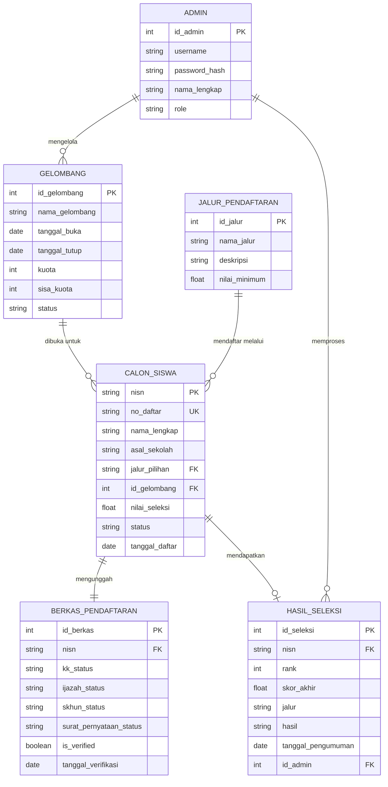
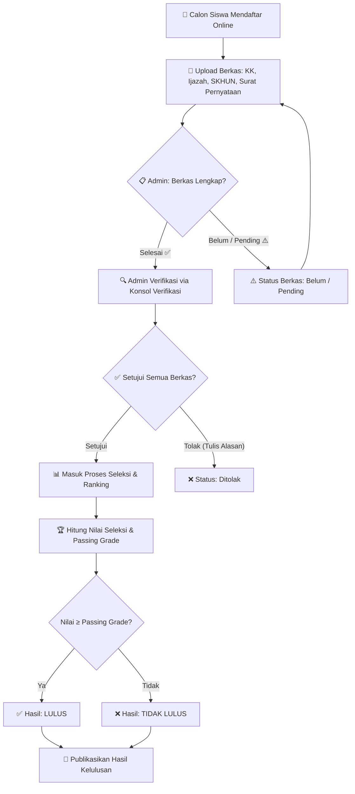
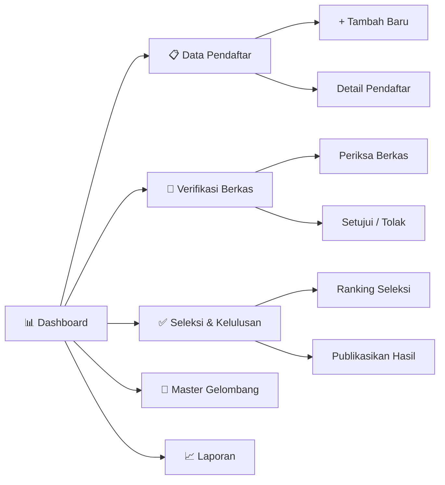

<p align="center">

# 📘 PERANCANGAN.md

## Milestone 1 — Perencanaan Menu & UI Wireframing

### Admin Panel PPDB Online (Sekolah Menengah)

---

**Mata Kuliah:** Pemrograman Web 2 | **Pekan Ke-3**

**Nomor Absen:** 10

| | |
|---|---|
| **Nama** | Galih Naufal Faturrohman |
| **NIM** | 231011402731 |

</p>

---

# DAFTAR ISI

1. [Informasi Umum Proyek](#1-informasi-umum-proyek)
2. [Struktur Direktori Proyek](#2-struktur-direktori-proyek)
3. [Hierarki Menu & Navigasi](#3-hierarki-menu--navigasi)
4. [ER-D Sederhana — Mermaid.js](#4-er-d-sederhana--mermaidjs)
5. [Flowchart Alur Proses PPDB — Mermaid.js](#5-flowchart-alur-proses-ppdb--mermaidjs)
6. [Design System (Figma)](#6-design-system-figma)
7. [High-Fidelity UI Design (Figma)](#7-high-fidelity-ui-design-figma)
8. [Penjelasan Tata Letak per Halaman](#8-penjelasan-tata-letak-per-halaman)
9. [Link Publik Figma & Stitch](#9-link-publik-figma--stitch)

---

# 1. Informasi Umum Proyek

| Item | Detail |
|------|--------|
| **Nama Aplikasi** | Admin Panel PPDB Online — Sekolah Menengah |
| **Jenis** | Admin Dashboard (Back-Office) |
| **Tema Visual** | Clean White + Blue Accent — Card-based layout, sidebar biru gradien, rounded corners, shadow lembut |
| **Palet Warna** | Primary `#2563EB` (Blue-600) · Sidebar `#1E40AF → #3B82F6` (Gradient) · Accent Green `#16A34A` · Warning Amber `#F59E0B` · Danger Red `#DC2626` · Surface `#FFFFFF` · Background `#F1F5F9` |
| **Tipografi** | **Inter** — Google Fonts (heading & body) |
| **Teknologi** | HTML5, CSS3 / Tailwind CSS v3, JavaScript ES6+ (Client-side only) |
| **Library** | Chart.js 4.x (grafik) · SweetAlert2 (dialog) · Feather Icons / Lucide Icons |
| **Data** | Mock / dummy data (JSON statis, tanpa backend) |
| **Responsive** | Desktop only (≥ 1024 px) |

---

# 2. Struktur Direktori Proyek

```text
ppdb-admin-panel/
│
├── index.html                    # Entry point — redirect ke dashboard
│
├── docs/
│   └── PERANCANGAN.md            # ← Dokumen ini
│
├── assets/
│   ├── css/
│   │   ├── tailwind-output.css   # Hasil build Tailwind (atau CDN)
│   │   └── custom.css            # Styling tambahan
│   ├── js/
│   │   ├── app.js                # Inisialisasi global & sidebar toggle
│   │   ├── dashboard.js          # Logika Chart.js & stat cards
│   │   ├── pendaftar.js          # CRUD tabel pendaftar (mock)
│   │   ├── verifikasi.js         # Logika checklist berkas
│   │   ├── seleksi.js            # Ranking & kelulusan
│   │   ├── gelombang.js          # CRUD gelombang
│   │   ├── laporan.js            # Generate laporan & fungsi cetak
│   │   └── data/
│   │       └── mock-data.json    # Dummy data pendaftar, gelombang, dsb.
│   ├── img/
│   │   ├── logo.png              # Logo PPDB Online
│   │   ├── avatar-admin.png      # Avatar admin default
│   │   └── figma/                # Screenshot hasil desain Figma
│   │       ├── 01-dashboard-desktop-mobile.png
│   │       ├── 02-dashboard-desktop.png
│   │       ├── 03-data-pendaftar.png
│   │       ├── 04-seleksi-kelulusan.png
│   │       └── 05-verifikasi-berkas.png
│   └── fonts/
│
├── pages/
│   ├── dashboard.html            # Halaman Dashboard
│   ├── pendaftar.html            # Data Pendaftar (Tabel)
│   ├── pendaftar-form.html       # Form Tambah / Edit
│   ├── verifikasi.html           # Verifikasi Berkas
│   ├── seleksi.html              # Seleksi & Kelulusan
│   ├── gelombang.html            # Master Gelombang
│   └── laporan.html              # Laporan & Cetak
│
├── components/
│   ├── sidebar.html              # Partial sidebar
│   └── navbar.html               # Partial top navbar
│
└── README.md
```

---

# 3. Hierarki Menu & Navigasi

## 3.1 Sidebar (Desktop)

Berdasarkan desain Figma, sidebar menggunakan **background biru gradien** dengan menu item berwarna putih. Menu aktif ditandai dengan **highlight biru terang + border-left kuning/putih**.

```text
┌──────────────────────────────────┐
│  🎓  PPDB Online                │
│     Panel Admin Utama            │
│  ─────────────────────────────  │
│                                  │
│  📊  Dashboard          ← aktif │
│  📋  Data Pendaftar              │
│  📂  Verifikasi Berkas           │
│  ✅  Seleksi & Kelulusan         │
│  📅  Master Gelombang            │
│  📈  Laporan                     │
│                                  │
└──────────────────────────────────┘
```

**Tabel Mapping Menu → Halaman:**

| No | Menu Sidebar | Ikon | File Target | Deskripsi |
|----|-------------|------|-------------|-----------|
| 1 | Dashboard | 📊 `LayoutDashboard` | `pages/dashboard.html` | Statistik ringkasan, grafik tren, gelombang aktif, pendaftar terbaru |
| 2 | Data Pendaftar | 📋 `Users` | `pages/pendaftar.html` | Tabel master CRUD calon siswa lengkap |
| 3 | Verifikasi Berkas | 📂 `FolderCheck` | `pages/verifikasi.html` | Antrian & checklist kelengkapan berkas |
| 4 | Seleksi & Kelulusan | ✅ `Award` | `pages/seleksi.html` | Ranking nilai, passing grade, status lulus/tidak |
| 5 | Master Gelombang | 📅 `Calendar` | `pages/gelombang.html` | CRUD periode gelombang pendaftaran |
| 6 | Laporan | 📈 `FileText` | `pages/laporan.html` | Rekapitulasi & cetak/ekspor data |

## 3.2 Top Navbar

```text
┌───────────────────────────────────────────────────────────────────┐
│  [Judul Halaman]     🔍 Cari pendaftar...      🔔   👤 Admin PPDB│
│                                                     Operator Pusat│
└───────────────────────────────────────────────────────────────────┘
```

| Elemen | Fungsi |
|--------|--------|
| Judul Halaman | Menampilkan nama halaman aktif (Dashboard, Data Pendaftar, dll.) |
| 🔍 Search Bar | Pencarian global pendaftar — filter client-side |
| 🔔 Notification Bell | Indikator berkas yang perlu diverifikasi |
| 👤 Admin Profile | Avatar + nama + role (Admin PPDB / Operator Pusat) |

---

# 4. ER-D Sederhana — Mermaid.js

Diagram berikut menggambarkan **relasi antar entitas** utama dalam sistem PPDB Online.



**Penjelasan Relasi Entitas:**

| Relasi | Kardinalitas | Keterangan |
|--------|-------------|------------|
| ADMIN → GELOMBANG | 1 : N | Admin mengelola banyak gelombang pendaftaran |
| ADMIN → HASIL_SELEKSI | 1 : N | Admin memproses & mempublikasikan hasil seleksi |
| GELOMBANG → CALON_SISWA | 1 : N | Satu gelombang memiliki banyak pendaftar |
| JALUR_PENDAFTARAN → CALON_SISWA | 1 : N | Satu jalur (Reguler/Prestasi/Zonasi/Afirmasi/Pindahan) dipilih banyak siswa |
| CALON_SISWA → BERKAS_PENDAFTARAN | 1 : 1 | Satu siswa memiliki satu set berkas yang harus diverifikasi |
| CALON_SISWA → HASIL_SELEKSI | 1 : 0..1 | Siswa mendapat hasil seleksi setelah diproses |

---

# 5. Flowchart Alur Proses PPDB — Mermaid.js

## 5.1 Alur Proses Utama



## 5.2 Sitemap Navigasi Halaman



---

# 6. Design System (Figma)

Berikut adalah **Design System** yang ditetapkan berdasarkan desain Figma untuk memastikan konsistensi visual di seluruh halaman.

## 6.1 Color Palettes

| Nama | Hex Code | Penggunaan |
|------|----------|------------|
| **Primary Blue** | `#2563EB` | Tombol utama, link aktif, highlight sidebar |
| **Sidebar Gradient** | `#1E40AF → #3B82F6` | Background sidebar (linear-gradient) |
| **Success Green** | `#16A34A` | Badge "Diterima", "Lulus", "Selesai", indikator positif |
| **Warning Amber** | `#F59E0B` | Badge "Pending", "Mulai 15 Jul", indikator menunggu |
| **Danger Red** | `#DC2626` | Badge "Ditolak", "Tidak Lulus", "Belum", "Gagal" |
| **Info Blue** | `#2563EB` | Badge "Terverifikasi", alert informasi |
| **Background** | `#F1F5F9` | Background halaman utama (abu sangat muda) |
| **Surface / Card** | `#FFFFFF` | Background card, tabel, panel konten |
| **Text Primary** | `#1E293B` | Judul, heading, teks utama |
| **Text Secondary** | `#64748B` | Subtitle, keterangan, label |
| **Border** | `#E2E8F0` | Garis pemisah tabel, border card |

## 6.2 Typography Styles

| Style | Font | Weight | Size | Penggunaan |
|-------|------|--------|------|------------|
| **Heading 1** | Inter | Bold (700) | 24px | Judul halaman ("Dashboard", "Data Pendaftar") |
| **Heading 2** | Inter | Semi-Bold (600) | 18px | Judul section ("Tren Pendaftaran Harian") |
| **Stat Number** | Inter | Bold (700) | 32px | Angka besar di stat card ("1,248", "892") |
| **Body** | Inter | Regular (400) | 14px | Teks tabel, deskripsi, paragraf |
| **Caption** | Inter | Regular (400) | 12px | Keterangan kecil, label, info tambahan |
| **Badge** | Inter | Medium (500) | 12px | Status badge (Diterima, Pending, Ditolak) |

## 6.3 Komponen Reusable (UI Components)

### Stat Card
```text
┌─────────────────────────────┐
│  Label            [Ikon]    │
│  ───────────────────────    │
│  1,248                      │  ← angka besar, bold
│  ↑ 12% dari kemarin         │  ← keterangan hijau/biru
└─────────────────────────────┘
```
- Background: `#FFFFFF`, Border: `1px solid #E2E8F0`, Radius: `12px`
- Ikon berwarna sesuai konteks (biru, hijau, amber, merah)

### Status Badge
| Varian | Style | Contoh |
|--------|-------|--------|
| Diterima | `bg-green-100 text-green-700 rounded-full px-3 py-1` | ![Diterima] |
| Terverifikasi | `bg-blue-100 text-blue-700 rounded-full px-3 py-1` | ![Terverifikasi] |
| Pending | `bg-amber-100 text-amber-700 rounded-full px-3 py-1` | ![Pending] |
| Ditolak | `bg-red-100 text-red-700 rounded-full px-3 py-1` | ![Ditolak] |
| Selesai | `bg-green-100 text-green-700 rounded-full px-3 py-1` | Berkas OK |
| Belum | `bg-red-100 text-red-700 rounded-full px-3 py-1` | Berkas belum ada |

### Button
| Varian | Style |
|--------|-------|
| Primary | `bg-blue-600 text-white rounded-lg px-4 py-2 hover:bg-blue-700` |
| Success | `bg-green-500 text-white rounded-lg px-4 py-2` |
| Danger Outline | `border-red-500 text-red-500 rounded-lg px-4 py-2` |
| Pagination | `bg-blue-600 text-white rounded-lg px-4 py-2` / `text-gray-500` |

### Alert / Banner
```text
┌─ ℹ️ ─────────────────────────────────────────────────────────────┐
│  Selamat Datang kembali di Panel PPDB Online                     │
│  Gelombang I tersisa 5 hari lagi sebelum penutupan. Segera       │
│  verifikasi berkas tertunda sebanyak 125 pendaftar.              │
└──────────────────────────────────────────────────────────────────┘
```
- Background: `#EFF6FF`, Border-left: `4px solid #2563EB`, Radius: `8px`

---

# 7. High-Fidelity UI Design (Figma)

Berikut adalah hasil desain **High-Fidelity** dari Figma untuk setiap halaman utama.

## 7.1 Dashboard (Desktop)


**Komponen yang ditampilkan:**

| Zona | Komponen | Detail |
|------|----------|--------|
| **Atas** | Alert Banner | Info gelombang & reminder verifikasi berkas |
| **Baris 1** | 4 × Stat Card | Total Pendaftar (1,248) · Terverifikasi (892) · Diterima (512) · Pending Verifikasi (125) |
| **Baris 2 Kiri** | Bar Chart | Tren Pendaftaran Harian — 10 hari terakhir (Chart.js) |
| **Baris 2 Kanan** | Gelombang Aktif | Card list gelombang dengan status & kuota |
| **Baris 3** | Tabel Pendaftar Terbaru | 5 data terakhir: Nomor, Nama, Asal Sekolah, Jalur, Status |

---

## 7.2 Data Pendaftar


**Komponen yang ditampilkan:**

| Zona | Komponen | Detail |
|------|----------|--------|
| **Atas** | 4 × Stat Card | Total Pendaftar (1,248) · Terverifikasi (892) · Pending Verifikasi (125) · Ditolak/Gagal (231) |
| **Toolbar** | Filter & Aksi | Dropdown Jalur · Dropdown Status · Tombol "+ Tambah Baru" (biru) |
| **Tabel** | Data Lengkap Calon Siswa | Kolom: NISN, Nama Lengkap, Asal Sekolah, Jalur Pilihan, Status, Aksi (Detail) |
| **Footer Tabel** | Pagination | "Menampilkan 1-5 dari 1,248 pendaftar" · Sebelumnya / Selanjutnya |

**Jalur Pilihan yang terdata:** Prestasi, Zonasi, Afirmasi, Pindahan

---

## 7.3 Verifikasi Berkas


**Komponen yang ditampilkan:**

| Zona | Komponen | Detail |
|------|----------|--------|
| **Atas** | Alert Banner (Oranye) | "Informasi Antrean — Ada 125 pendaftar baru yang berkasnya membutuhkan verifikasi segera untuk Gelombang I" |
| **Kiri** | Tabel Antrean Berkas Siswa | Kolom: Nama Calon Siswa, KK, Ijazah, SKHUN, Aksi. Setiap sel berkas memiliki badge Selesai/Pending/Belum |
| **Kanan** | Konsol Verifikasi | Panel detail siswa yang sedang diperiksa: Nama, Asal Sekolah, Jalur. Checklist persyaratan (✅/⬜). Tombol "Setujui Semua Berkas" (hijau) & "Tolak Berkas (Tulis Alasan)" (merah outline) |

**Status Berkas per Dokumen:**
- ✅ **Selesai** (hijau) — Dokumen sudah diunggah dan valid
- ⚠️ **Pending** (kuning) — Dokumen diunggah tapi belum diperiksa
- ❌ **Belum** (merah) — Dokumen belum diunggah

---

## 7.4 Seleksi & Kelulusan


**Komponen yang ditampilkan:**

| Zona | Komponen | Detail |
|------|----------|--------|
| **Atas** | 3 × Stat Card | Total Kuota Pagu (1,000) · Pendaftar Lulus Seleksi (512) · Passing Grade Terendah (78.50) |
| **Toolbar** | Filter & Aksi | Dropdown Gelombang · Tombol "Publikasikan Hasil Kelulusan" (biru) |
| **Tabel** | Hasil Peringkat Kelulusan Sementara | Kolom: Rank (#1–#5), No. Daftar, Nama Lengkap, Nilai Seleksi, Jalur, Hasil (LULUS/TIDAK LULUS) |

**Keterangan Hasil:**
- **LULUS** (hijau) — Nilai di atas passing grade
- **TIDAK LULUS** (merah) — Nilai di bawah passing grade

---

# 8. Penjelasan Tata Letak per Halaman

## 8.1 Layout Global

Seluruh halaman menggunakan layout 2 kolom yang sama:

```text
┌──────────┬──────────────────────────────────────────────┐
│          │            TOP NAVBAR                         │
│  SIDEBAR │  ┌──────────────────────────────────────────┐│
│  (Fixed) │  │                                          ││
│  w:220px │  │          CONTENT AREA                    ││
│          │  │          (Scrollable)                     ││
│          │  │                                          ││
│          │  └──────────────────────────────────────────┘│
└──────────┴──────────────────────────────────────────────┘
```

- **Sidebar:** Fixed left, width 220px, background gradient biru
- **Navbar:** Sticky top, height 64px, background putih, shadow
- **Content:** Padding 24px, background `#F1F5F9`, scrollable

## 8.2 Dashboard — Grid Layout

```text
┌──────────────────────────────────────────────────┐
│  [ Alert Banner — full width ]                   │
├───────────┬───────────┬───────────┬──────────────┤
│  Stat 1   │  Stat 2   │  Stat 3   │   Stat 4     │  grid-cols-4
├───────────┴───────────┴───────────┼──────────────┤
│                                   │              │
│  Bar Chart — Tren Pendaftaran     │  Gelombang   │  grid: 2fr + 1fr
│  Harian (Chart.js)                │  Aktif       │
│                                   │              │
├───────────────────────────────────┴──────────────┤
│  Tabel Pendaftar Terbaru — full width            │  col-span-full
│  + Tombol "Lihat Semua →"                        │
└──────────────────────────────────────────────────┘
```

## 8.3 Data Pendaftar — Grid Layout

```text
┌───────────┬───────────┬───────────┬──────────────┐
│  Stat 1   │  Stat 2   │  Stat 3   │   Stat 4     │  grid-cols-4
├───────────┴───────────┴───────────┴──────────────┤
│  Toolbar: [Jalur ▼] [Status ▼]     [+ Tambah]   │
├──────────────────────────────────────────────────┤
│  Tabel Data Lengkap Calon Siswa                  │
│  NISN | Nama | Asal Sekolah | Jalur | Status |Aksi│
├──────────────────────────────────────────────────┤
│  Pagination: Sebelumnya  [1] [2] [3]  Selanjutnya│
└──────────────────────────────────────────────────┘
```

## 8.4 Verifikasi Berkas — 2 Panel Layout

```text
┌──────────────────────────────────────────────────┐
│  [ Alert Banner Oranye — Informasi Antrean ]     │
├───────────────────────────┬──────────────────────┤
│                           │                      │
│  Antrean Berkas Siswa     │  Konsol Verifikasi   │
│  (Tabel: Nama, KK,       │  - Nama siswa aktif  │
│   Ijazah, SKHUN, Aksi)   │  - Checklist berkas  │
│                           │  - [Setujui] [Tolak] │
│                           │                      │
└───────────────────────────┴──────────────────────┘
```
- **Grid:** `grid-cols-3` — Tabel (2fr) + Konsol (1fr)

## 8.5 Seleksi & Kelulusan — Grid Layout

```text
┌───────────────────┬───────────────────┬──────────┐
│  Total Kuota Pagu │ Lulus Seleksi     │ Passing  │  grid-cols-3
│  1,000            │ 512               │ Grade    │
│                   │                   │ 78.50    │
├───────────────────┴───────────────────┴──────────┤
│  Toolbar: [Gelombang ▼]    [Publikasikan Hasil]  │
├──────────────────────────────────────────────────┤
│  Tabel Ranking:                                  │
│  Rank | No.Daftar | Nama | Nilai | Jalur | Hasil │
└──────────────────────────────────────────────────┘
```

---

# 9. Link Publik Figma & Stitch

## 9.1 🎨 Link Figma — High-Fidelity Design

> **Figma Project — PPDB Admin Panel**
>
> 🔗 **URL Figma (Design File):**
> [https://www.figma.com/design/n228dBghpdXF1MbBAGA1Gw/Untitled?node-id=0-1&t=9hiSfuRVyJI0tkXk-1](https://www.figma.com/design/n228dBghpdXF1MbBAGA1Gw/Untitled?node-id=0-1&t=9hiSfuRVyJI0tkXk-1)
>
> 🔗 **URL Figma (Prototype):**
> [https://www.figma.com/proto/n228dBghpdXF1MbBAGA1Gw/Untitled?node-id=2-5&t=rdJN9QZm3UAbo3eE-1&scaling=contain&content-scaling=fixed&page-id=0%3A1](https://www.figma.com/proto/n228dBghpdXF1MbBAGA1Gw/Untitled?node-id=2-5&t=rdJN9QZm3UAbo3eE-1&scaling=contain&content-scaling=fixed&page-id=0%3A1)
>
> Mode: **View Only**

## 9.2 🖼️ Screenshot Hasil Rancangan Figma

Berikut embed screenshot dari hasil desain Figma yang menjadi acuan implementasi:

### Dashboard


### Data Pendaftar


### Verifikasi Berkas


### Seleksi & Kelulusan


## 9.3 🧵 Stitch by Google

> **Stitch by Google — Hasil Rancangan**
>
> 🔗 **URL Stitch:** `[TEMPEL LINK STITCH DI SINI]`
>
> Screenshot Stitch:
>
> <!-- Uncomment & ganti path setelah menambahkan file screenshot Stitch -->
> <!--  -->
> <!--  -->

---

<p align="center">

**— Akhir Dokumen PERANCANGAN.md —**

**Milestone 1 — Pekan Ke-3**

Disusun oleh: **Galih Naufal Faturrohman** — **231011402731**

Pemrograman Web 2 · Tahun Ajaran 2026/2027

</p>
